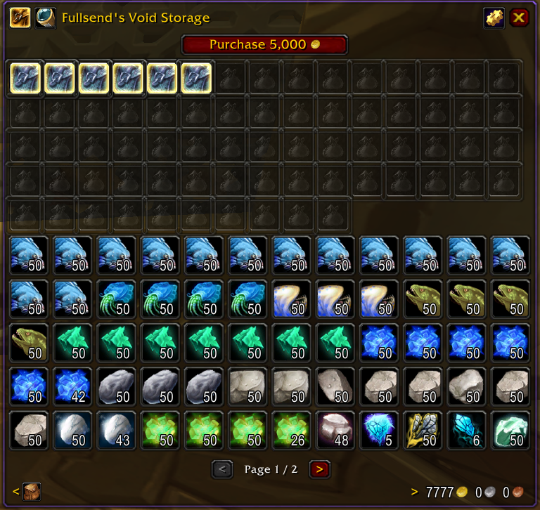
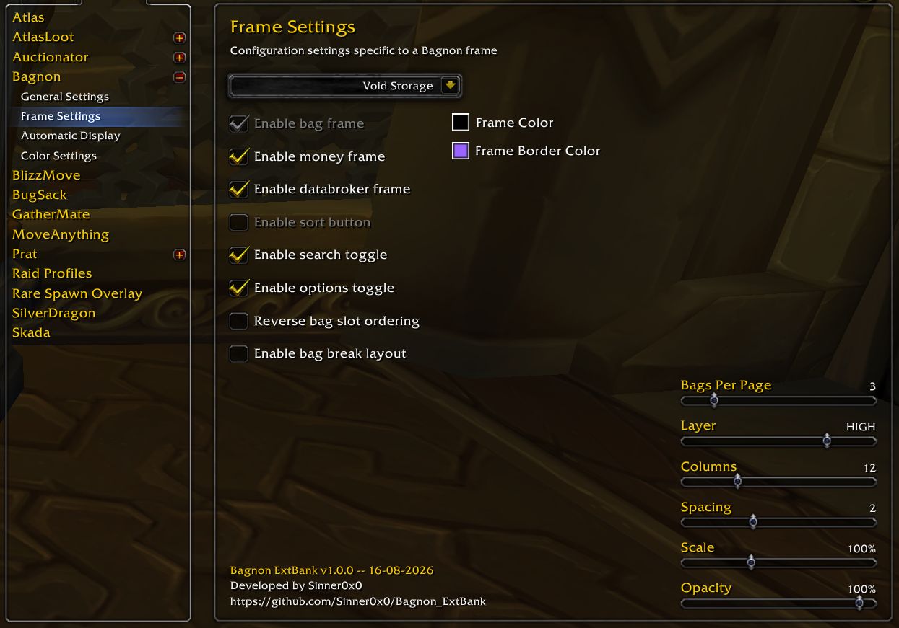

# Bagnon ExtBank (Void Storage)

This addon changes how the **Void Storage** window looks and works on
ProjectEbonhold. Instead of the small built-in window, your Void Storage
bags are shown the same way Bagnon shows your regular bags.

<p align="center">
  
</p>

---

## What you need

Three pieces have to line up, and only one of them is something you go out
and install:

| # | What | Where it comes from |
|---|---|---|
| 1 | The **ProjectEbonhold client** — WotLK 3.3.5a (build 12340) | You already have it: it's what you log in with. |
| 2 | **Bagnon for 3.3.5a** — [RichSteini/Bagnon-3.3.5](https://github.com/RichSteini/Bagnon-3.3.5) | You install this. |
| 3 | **Bagnon Config** | Ships in the same download as #2. |

Bagnon is what this addon attaches to: it plugs straight into that
version's internals to hang a Void Storage window off the same machinery
that draws your bags and bank. `Bagnon_Config` is the panel it adds its own
options to — without it everything still works, you just have no way to
change the settings.

Void Storage itself is a ProjectEbonhold feature: your items, the gold cost
per slot, and how many slots you own are all tracked by the server, and the
small built-in window comes with the client. This addon doesn't add Void
Storage — it only re-draws it. So there's nothing to install for that side
of it, and nothing to uninstall if you also play somewhere else: on a
client without Void Storage, this addon sits quietly and does nothing.

## Installing

1. Install Bagnon for 3.3.5a first, if you don't have it.
2. Put the `Bagnon_ExtBank` folder into `Interface\AddOns\`. The folder name
   has to stay exactly `Bagnon_ExtBank`.
3. Start the game, or type `/reload` if you're already logged in.

There's nothing to switch on after that. With both addons installed, this
one replaces the default Void Storage window automatically, and nothing
about how you *open* Void Storage changes: click the same button on the
bank window (or use whatever key/macro you already use) like always.

---

## What you'll see

When you open Void Storage, two things appear:

1. **The bag-slot strip**, near the top. This is a block of squares — one
   for every Void Storage bag slot that exists (70 in total), whether or not
   you've bought it yet. Each square is either:
   - **Locked** (greyed out) — you haven't purchased this slot yet.
   - **Empty** — purchased, but no bag equipped in it.
   - **Equipped** — has a bag in it. Click it to show or hide that bag's
     items in the grid below.

2. **The item grid**, below the strip. This shows the actual contents —
   every item, in every bag slot you've toggled on — as one continuous
   grid, exactly like your regular bags look in Bagnon.

## Buying more bag slots

Above the bag-slot strip is a **Purchase** button showing the gold cost of
your next slot. Click it, confirm the popup, and (assuming you have enough
gold) a new slot unlocks. Once you've bought all 70 slots, the Purchase
button disappears — there's nothing left to buy. (Whether you've actually
equipped bags in them makes no difference; only the purchase count matters.)

## Equipping and un-equipping bags

- **To equip a bag**: drag it from your inventory onto an empty (unlocked)
  square in the bag-slot strip.
- **To toggle a bag's contents on/off**: left-click an equipped square.
  This just hides/shows it in the grid — it doesn't unequip anything.
- **To un-equip a bag**: right-click an equipped square. The bag must be
  completely empty first.

## Moving items around

Inside the Void Storage window, you can move items between slots two ways:

- **Click, then click again**: left-click an item to pick it up, then
  left-click an empty slot to drop it there. Works with Paging feature.
- **Click and drag**: hold the left mouse button down on an item and drag
  it to another slot, then let go — same as dragging items in your regular
  bags. Works with Paging feature.

Either way, the slot you drop on has to be **empty**. Void Storage has no swap
and no stack-merge, so dropping onto a slot that already holds something is
refused and nothing moves.

To take an item **out** of Void Storage and put it back in your bags:
- **Right-click it** (or shift-click it) while it's in the Void Storage
  window. It goes straight to your bags.

To put an item **into** Void Storage from your regular bags/backpack:
- **Right-click it**. If the page you're looking at has a free slot, that's
  where it goes. If that page is full, it goes to a free slot on another page
  instead, and you'll see a brief on-screen message saying so.
- **Drag an item in with the mouse**.

## Paging through your bags

With up to 70 bags of up to 36 slots each, showing everything at once would
be an enormous, unusable wall of squares. So the item grid is split into
**pages**, showing a handful of whole bags per page (never splitting one
bag's items across two pages).

You can change pages three ways:
- **Scroll the mouse wheel** while hovering over the item grid.
- Use the **`<` and `>` buttons** on the page bar underneath the grid.
- The page bar also shows **"Page X / Y"** so you always know where you are.

If everything fits on one page, the page bar just doesn't show up — there's
nothing to page through.

You can change how many bags are shown per page in the options (see
below) — fewer bags per page means smaller/simpler pages with more page
flipping; more bags per page means bigger pages you flip through less
often.

## Searching

The same item search box you use for your regular bags also searches your
Void Storage items — matching items stay full brightness, and everything
else dims, exactly like it does for your normal bags and bank.

## Settings

**Interface Options → Addons → Bagnon → Frame Settings** -> pick **Void Storage** from the dropdown at the top of the panel. From
there you can adjust:

- **Bags Per Page** — how many equipped bags are shown on one page at a
  time.
- The usual Bagnon-wide display options (columns, spacing, item scale,
  opacity, empty-slot background, etc.) — these apply the same way they do
  to your other Bagnon windows.

<p align="center">
  
</p>

"Enable bag frame" and "Enable sort button" are greyed out on purpose. The
bag-slot strip already has its own toggle on the window itself, and there's
no sorting for Void Storage — the same way Bagnon greys them out for its own
keyring and guild bank.

## Something not working?

**The small built-in window still opens.** Then this addon isn't loading.
Check that Bagnon for 3.3.5a is installed and enabled (see "What you
need"), and that this addon's folder is named exactly `Bagnon_ExtBank`.

---

## Working on this addon

*Only relevant if you're editing the code — skip this if you just want to
use it.*

Run this once after cloning:

```
git config core.hooksPath .githooks
```

That switches on the hooks in [.githooks/](.githooks). They exist because the
version and date live in two places that must agree: `## Version:` / `## X-Date:`
in `Bagnon_ExtBank.toc` (what addon managers list, and what the release
workflow reads), and `ExtBank.VERSION` / `ExtBank.DATE` in `main.lua` (what the
options panel prints — it can't use the `.toc` values, because the client only
re-reads those on a full restart, not on `/reload`).

You never edit either date, and you never edit the version in `main.lua`. Bump
`## Version:` in the `.toc` when you want to release, and the `pre-commit` hook
mirrors it into `main.lua` and stamps both files with the current date as you
commit. `pre-push` and CI re-check that the two files agree, so a commit made
with hooks off can't quietly ship a header that lies. To stamp by hand:

```
bash .github/scripts/stamp-version.sh          # write both files
bash .github/scripts/stamp-version.sh --check  # verify, write nothing
```

---

## Credits and license

This addon is released under the **MIT License** — see [LICENSE](LICENSE).
You're free to use, modify, and redistribute it, including as part of an
addon pack; just keep the copyright notice with it.

That covers this addon's own code only. It also builds on work it depends
on but does **not** include:

- **Bagnon**, by Tuller and Jaliborc, in the
  [3.3.5a backport by RichSteini](https://github.com/RichSteini/Bagnon-3.3.5).
  The window you see here is built out of Bagnon's own component classes and
  follows their design closely, but no Bagnon code ships in this folder —
  you install Bagnon separately, from the link above. Bagnon is under its
  own license, not this one.
- **Void Storage itself**, a ProjectEbonhold feature — the server side, the
  client support, and the built-in window this addon replaces. The per-slot
  gold prices shown on the Purchase button are read from ProjectEbonhold's
  own Void Storage UI so they match what the built-in window quotes.
